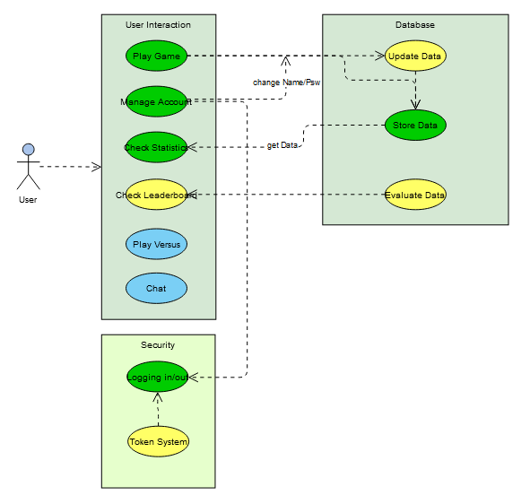

# GuessWhere - Software Requirements Specification

## Table of Contents

-   [GuessWhereTeam - Software Requirements Specification](#guesswhereteam---software-requirements-specification)

    -   [Table of Contents](#table-of-contents)

    -   [1. Introduction](#1-introduction)

        -   [1.1 Purpose](#11-purpose)
        -   [1.2 Scope](#12-scope)
        -   [1.3 Definitions, Acronyms and Abbreviations](#13-definitions-acronyms-and-abbreviations)
        -   [1.4 References](#14-references)
        -   [1.5 Overview](#15-overview)

    -   [2. Overall Description](#2-overall-description)

        -   [2.1 Vision](#21-vision)

        -   [2.2 Product perspective](#22-product-perspective)

        -   [2.3 User characteristics](#23-user-characteristics)
    
        -   [2.4 Dependencies](#24-dependencies)

    -   [3. Specific Requirements](#3-specific-requirements)

        -   [3.1 Functionality](#31-functionality)
        
            - [3.1.1 The Game](#311-the-game)
            - [3.1.2 Interface](#312-interface)
            - [3.1.3 User accounts](#313-user-accounts)
            - [3.1.4 Database](#314-database)
            - [3.1.5 Statistics](#315-statistics)
            - [3.1.6 Leaderboard](#316-leaderboard)
            - [3.1.7 Friends](#317-friends)
            - [3.1.8 Versus mode](#318-versus-mode)
            - [3.1.9 Chat function](#319-chat-function)

        -   [3.2 Reliability](#32-reliability)

            -   [3.2.1 Availability](#321-availability)
            -   [3.2.2 MTBF, MTTR](#322-mtbf-mttr)
            -   [3.2.3 Accuracy](#323-accuracy)
            -   [3.2.4 Bug classes](#324-bug-classes)

        -   [3.3 Performance](#33-performance)

            -   [3.3.1 Response time](#331-response-time)
            -   [3.3.2 Throughput](#332-throughput)
            -   [3.3.3 Capacity](#333-capacity)
            -   [3.3.4 Resource utilization](#334-resource-utilization)

        -   [3.4 Supportability](#34-supportability)

        -   [3.5 Design Constraints](#35-design-constraints)

            -   [3.5.1 Development tools](#351-development-tools)
            -   [3.5.2 Spring Boot](#352-spring-boot)
            -   [3.5.3 ReactJS](#353-reactjs)
            -   [3.5.4 Supported Platforms](#354-supported-platforms)

        -   [3.6 Online User Documentation and Help System Requirements](#36-online-user-documentation-and-help-system-requirements)

        -   [3.7 Purchased Components](#37-purchased-components)

        -   [3.8 Interfaces](#38-interfaces)

            -   [3.8.1 User Interfaces](#381-user-interfaces)
            -   [3.8.2 Hardware Interfaces](#382-hardware-interfaces)
            -   [3.8.3 Software Interfaces](#383-software-interfaces)
            -   [3.8.4 Communications Interfaces](#384-communications-interfaces)

        -   [3.9 Licensing Requirements](#39-licensing-requirements)

        -   [3.10 Legal, Copyright and other Notices](#310-legal-copyright-and-other-notices)

        -   [3.11 Applicable Standards](#311-applicable-standards)

    -   [4. Supporting Information](#4-supporting-information)

## 1. Introduction

### 1.1 Purpose
This Software Requirements Specification (SRS) describes all specifications for the application "GuessWhere". It includes an overview about this project and its vision, detailed information about the planned features and boundary conditions of the development process.

### 1.2 Scope
The project is going to be realized as an Android App.  
  
Planned Subsystems are: 
* The Game:  
The game is the essential part of the app. Game sessions should be visualized as postings including relevant information about the session. Those should be partly standardized by a form with a free text option for specifics. The data must be stored accordingly.

* Account System:  
Users can create accounts to save their progress made in the game. User data must be stored alongside the posting data.

* Friend List:  
Once the account system is created there will be the option to mark users as favorites.

* User Ranking:
There should be a leaderboard for users to compare themselves amongst each other.

* Storing Data:  
User data for accounts and possibly profiles has to be stored. Also game statistics have to be stored in order to be used for the leaderboard.

### 1.3 Definitions, Acronyms and Abbreviations

| Term     |                                     |
| -------- | ----------------------------------- |
| **SRS**  | Software Requirements Specification |
| **JSON** | JavaScript Object Notation          |
| **API**  | Application Programming Interface   |
| **MTBF** | Mean Time Between Failures          |
| **MTTR** | Mean Time To Repair                 |
| **DTO**  | Data Transfer Object                |
| **HTTP** | Hypertext Transfer Protocol         |
| **FAQ**  | Frequently Asked Questions          |
| **REST** | Representational State Transfer     |

### 1.4 References

| Title                                                                                                 | Date       |
| ----------------------------------------------------------------------------------------------------- | ---------- |
| [Blog](https://wordpress.com/page/guesswheregame.wordpress.com)                                       | 21/10/2020 |
| [GitHub](https://github.com/Eightdays1/guesswhere)                                                    | 21/10/2020 |

### 1.5 Overview

## 2. Overall Description

### 2.1 Vision
The app we want to create is a game where you are shown a picture from somewhere around the world and you have to point somewhere on the world map where you think this location is. The closer you are the more points you get. We were inspired by several other games that are similar to our idea. Most of these are either browser games or are badly implemented f.e. with lots of ads or paylocked-content. We plan to create this without those "features".

## 2.2 Product perspective
In addition to the game, we want to implement several other features that are supposed to make the game experience even better. Those are for example a general account system, a database, a leaderboard and friendslist. 

### 2.3 User characteristics
A user is defined by a Username, an unchangeable ID, a score and a list of ID's they're friends with. 

### 2.4 Dependencies
Not decided yet, though we are probably going to use python for the backend.

## 3. Specific Requirements
### 3.1 Functionality
This section explains all of the functional requierements and the order in which we plan to implement them.
3.1.1 The Game
3.1.2 Interface
3.1.3 User accounts
3.1.4 Database
3.1.5 Statistics
3.1.6 Leaderboard
3.1.7 Friends
Possibly:
3.1.8 A versus mode
3.1.9 A chat function

#### 3.1.1 The Game
First we need to create a running app in which you can play the game we described above. This process will probably take the longest.
https://github.com/Eightdays1/guesswhere/blob/main/Use-Case_StartGame.md

#### 3.1.2 Interface
Once the game is running an interface needs to be created. This includes thing like buttons labeled with 'Play', 'Settings', etc.

#### 3.1.3 User accounts
Next the possibility of creating accounts and saving your data will be implemented. This forms the basis for the steps 4 to 7.

#### 3.1.4 Database
The data collected through the user accounts needs to be stored in a central, accesible place. For this we'll connect the app to a database.

#### 3.1.5 Statistics
Once the database is running, the user should be able to access it. This will be visible in a statistics window.

#### 3.1.6 Leaderboard
From there the database and the statistics can be accessed. With this basis we'll create a leaderboard which all users can look at.

#### 3.1.7 Friends
User's should be able to be friends with other players. At first this only makes it easier to look at each others stats. In chapter 3.1.8 the function of a versus mode may be added.

#### 3.1.8 Versus mode
Like in other apps (f.e. Quizduell) a versus mode shall be implemented. In ~3 rounds the players will take turns to guess their location. At the end a winner is declared.
https://github.com/Eightdays1/guesswhere/blob/main/Use-Case_Challenge_User.md

#### 3.1.9 Chat function
The least important feature is the chat function. Users should be able to communicate with each other in versus mode. If there is time left, this will be implemented as well.

### 3.2 Reliability
To Be Determined

#### 3.2.1 Availability
To Be Determined

#### 3.2.2 MTBF, MTTR
To Be Determined

#### 3.2.3 Accuracy
To Be Determined

#### 3.2.4 Bug classes
To Be Determined

### 3.3 Performance
To Be Determined

#### 3.3.1 Response time
To Be Determined

#### 3.3.2 Throughput
To Be Determined

#### 3.3.3 Capacity
To Be Determined

#### 3.3.4 Resource utilization
To Be Determined

### 3.4 Supportability
To Be Determined

### 3.5 Design Constraints
To Be Determined

#### 3.5.1 Development tools
To Be Determined

#### 3.5.2 Spring Boot
To Be Determined

#### 3.5.3 ReactJS
To Be Determined

#### 3.5.4 Supported Platforms
To Be Determined

### 3.6 Online User Documentation and Help System Requirements
To Be Determined

### 3.7 Purchased Components
To Be Determined

### 3.8 Interfaces
To Be Determined

#### 3.8.1 User Interfaces
To Be Determined

#### 3.8.2 Hardware Interfaces
To Be Determined

#### 3.8.3 Software Interfaces
To Be Determined

#### 3.8.4 Communications Interfaces
To Be Determined

### 3.9 Licensing Requirements
To Be Determined

### 3.10 Legal, Copyright and other Notices
To Be Determined

### 3.11 Applicable Standards
To Be Determined

## 4. Supporting Information
To Be Determined

<!-- Picture-Link definitions: -->
[OUCD]: https://github.com/Eightdays1/guesswhere/blob/main/UseCaseDiagram.png "Overall Use Case Diagram"
