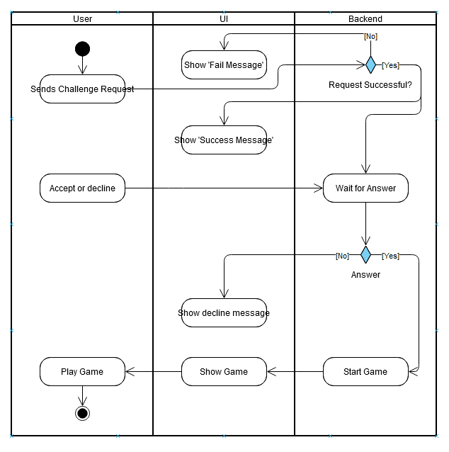

# 1 Use-Case Name
Challenge User

## 1.1 Brief Description
To challenge another user, you first have to befriend them. After that you send click a button to send an invite. Should the other user accept the invitation in a specific timeframe, the game starts for both users.

# 2 Flow of Events
## 2.1 Basic Flow
- (optional) befriend a user via the friends feature
- User clicks 'challenge' button on another user
- Other user either accepts or declines the request
- If accepted, start a game for both users
- At the end, compare the results of the game. Both users play the same game, which means they get the same pictures.

### 2.1.1 Activity Diagram

## 2.2 Alternative Flows
(n/a)

# 3 Special Requirements
(n/a)

# 4 Preconditions
The user must have entered a username.

# 5 Postconditions
(n/a)
 
# 6 Extension Points
(n/a)
