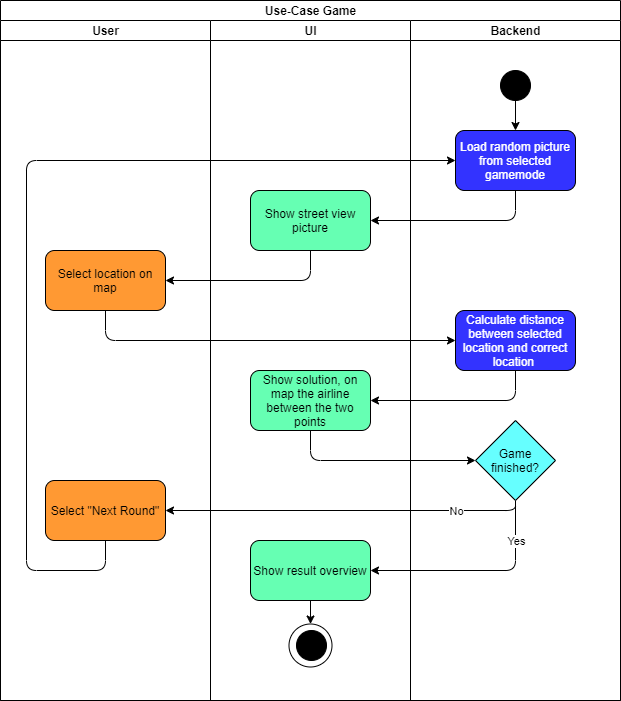

# 1 Use-Case Name
Game

## 1.1 Brief Description
Play a new game with random pictures/locations.

# 2 Flow of Events
## 2.1 Basic Flow
- Load random picture (based on gamemode)
- Show the picture to the user
- After the user selected a location on the map: calculate the distance between the location set by the user and the location from the database
- Show the result to the user
- If it wasn't the last round, offer the user to press "Next round".
- If it was the last round, show the overwiew to the user.

### 2.1.1 Activity Diagram

## 2.2 Alternative Flows
(n/a)

# 3 Special Requirements
(n/a)

# 4 Preconditions
The user must be logged in.

# 5 Postconditions
(n/a)
 
# 6 Extension Points
(n/a)
