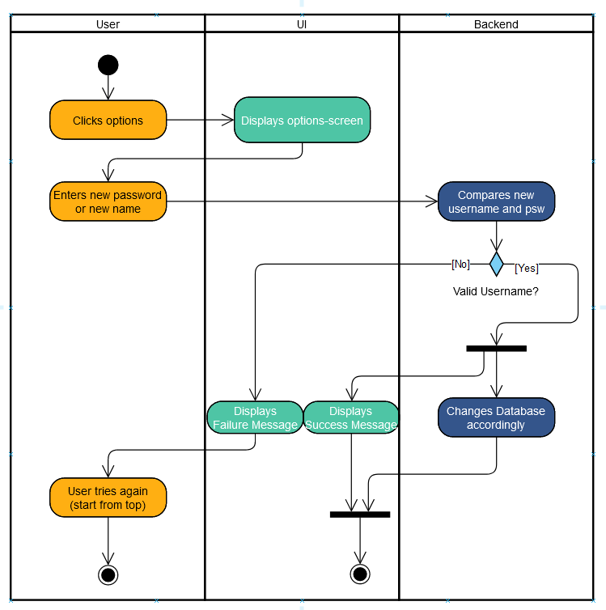

# 1 Use-Case Name
Options

## 1.1 Brief Description
Lets the player change their username or password in the option-screen.

# 2 Flow of Events
## 2.1 Basic Flow
- When the userer tabs "options", show the options-screen.
- The user enters the new password or username.
- If the new username or password is valid, the database-entry is changed and a success-message is shown.
- If the new username or password is not valid, a failure-message is shown. The user can try again.

### 2.1.1 Activity Diagram

## 2.2 Alternative Flows
(n/a)

# 3 Special Requirements
(n/a)

# 4 Preconditions
The user must be logged in.

# 5 Postconditions
(n/a)
 
# 6 Extension Points
(n/a)
