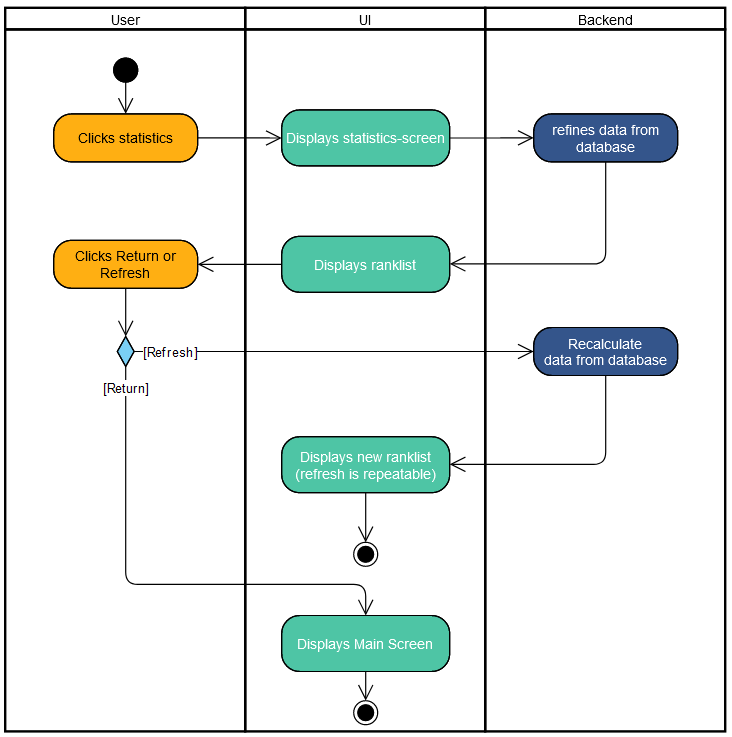

# 1 Use-Case Name
Statistics

## 1.1 Brief Description
Displays the statisctic for the current user as well as the leaderboard.

# 2 Flow of Events
## 2.1 Basic Flow
- When the userer tabs "Statistics" the statisctics-screen is shown.
- Data is pulled from the database and gets refined.
- The user-statistics and the leaderboard are shown.
- If the User tabs "refresh", the data is pulled again from the database and the new statisctics and leaderboard are shown.
- If the user tabs "return" the main screen is shown.

### 2.1.1 Activity Diagram

## 2.2 Alternative Flows
(n/a)

# 3 Special Requirements
(n/a)

# 4 Preconditions
The user must be logged in.
The user must have played at least one game.

# 5 Postconditions
(n/a)
 
# 6 Extension Points
(n/a)
